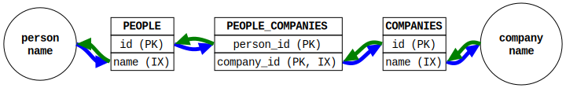

# Associative Entity (redux)

A little test to show performance differences between indexing strategies in MySQL and PostgreSQL.

## Thesis

The proper way to define 3-table relations in MySQL and PostgreSQL differ. In MySQL, the index on the associative entity should only contain the second column of the primary key. In PostgreSQL, the index on the associative entity should contain both columns, but in the reverse order of the primary key. This is due to the different approaches taken in MySQL and PostgreSQL to storing non-key data and what that means for how secondary indices are constructed.

## Explanation

### Abstract view of the problem



Abstractly, we can think of our problem as three tables. This breaks down pretty quickly when you consider that the primary key of the `PEOPLE_COMPANIES` table has an order. In other words, looking up by `company_id` is like trying to look up by first name in the phone book: A full table scan is necessary.


Adding an index on `company_id` allows for `O(log n)` lookups in both directions, which is what we want. The definition of this secondary index depends on the database engine, which means that a one-size-fits-all schema is not possible.

### MySQL vs. PostgreSQL

In MySQL (and SQL Server), the primary key is a clustered index, meaning that each row is made up of the primary key columns (sorted) with the non-key columns there in the row. As a result, secondary (non-clustered) indices contain the index key column(s) and the primary key. If a query using the non-clustered index uses a non-key column, the engine will use the primary key columns to look up the non-key data in the clustered index. That means that the cost of your query is `O(log n) + O(m * log(l))` where `n` is the number of keys looked up in your non-clustered index and `m` is the number of rows resolved by that non-clustered lookup that need to be retrieved from the clustered index, and `l` is the number of rows in the table.

For our use case, we can consider the reverse-lookup secondary index to be a map of `company_name -> {person_id, company_id}`, so there is no reason to look the person_id up in the clustered index -- we already have it. This makes our query run in `O(log n)` time.

PostgreSQL made a different choice in terms of table structure. As noted in the [documentation](https://www.postgresql.org/docs/current/indexes-index-only-scans.html):

> All indexes in PostgreSQL are secondary indexes, meaning that each index is stored separately from the table's main data area (which is called the table's heap in PostgreSQL terminology). This means that in an ordinary index scan, each row retrieval requires fetching data from both the index and the heap.

The location in the heap is defined as a `ctid`, which is an offset into the heap. The benefit of this is that the primary index is denser, which means more keys per page, more pages in the cache, etc. The downside of this is that heap lookups are common.

The primary key requires both columns for uniqueness, so there will be no heap lookup for queries that request in the order of the primary key. We can also avoid the heap lookup when going the other direction by making the secondary index cover both parts of the primary key.

## Experiment

Each schema is loaded with the same set of 1,000,000 random people, 1,000,000 random companies, and 5,000,000 unique relations between them. Each query cycle is choosing 1,000 names to query. Each test runs 10 times, throwing out the high and low times and averaging the rest.

This experiment used databases under Docker. This is not a good idea on a Mac, but we can ignore that because we are only interested in relative performance.

* [schemata](load/schemata/)
* Queries
  * [postgresql](bench/pg.go)
  * [mysql](bench/my.go)

### Running the experiment

1. Start the databases using `docker compose up`
2. Load the data using `go run . load
    * This will take a while, especially the `people_companies` table
    * ~12 mins on my test machine
3. Run the test using `go run . bench`

### Test environment

Note that these were not taken in a clean environment, so a certain amount of variability is expected.

* **Hardware**: 2021 16" MacBook Pro (plugged in)
  * M1 Max (8 performance, 2 efficiency cores)
  * 64 GiB of RAM
* **Software**:
  * MacOS 15.3.2
  * Docker 28.0.4
  * Go 1.24.2
    * [github.com/jackc/pgx/v5](https://github.com/jackc/pgx/v5) v5.7.4
    * [github.com/go-sql-driver/mysql](https://github.com/go-sql-driver/mysql) v1.9.1
  * MySQL 9.4
  * Postgres 17.4

### Results

All time are in ns/query.

* **baseline**: time to query names from the database. Measures the cost of talking to the database in a query we know is `O(log n)`
* **p2c**: given the names of 1000 people, find all related companies
* **c2p**: given the names of 1000 companies, find all related people
* **delta**: ratio of p2c and c2p as `((p2c/c2p)-1)*100`
* *delta_b*: same as delta, but with the baseline subtracted from both sides

| engine   | test    | baseline | p2c     | c2p     | delta   | delta_b |
| -------- | ------- | -------: | ------: | ------: | ------: | ------: |
| postgres | cover   |  178,273 | 216,370 | 215,697 |   0.31% |   1.80% |
| postgres | nocover |  181,155 | 221,514 | 271,955 | -18.55% | -55.55% |
| mysql    | cover   |  383,403 | 634,976 | 690,775 |  -8.08% | -18.15% |
| mysql    | nocover |  384,590 | 650,584 | 695,693 |  -6.48% | -14.50% |

### Sizes

All values are in bytes. Queries are in the [appendix](#table-size-queries).

|engine    | table_schema | table_name       | data_size   | index_size   | total_size   |
|--------- | ------------ | ---------------- | ----------: | -----------: | -----------: |
| postgres | cover        | companies        |  67,665,920 |   97,525,760 |  165,240,832 |
| postgres | cover        | people           |  67,657,728 |   97,943,552 |  165,650,432 |
| postgres | cover        | people_companies | 181,239,808 |  296,165,376 |  477,478,912 |
| postgres | nocover      | companies        |  67,665,920 |   92,667,904 |  160,382,976 |
| postgres | nocover      | people           |  67,657,728 |   92,446,720 |  160,153,600 |
| postgres | nocover      | people_companies | 181,239,808 |  223,936,512 |  405,250,048 |
| mysql    | cover        | companies        |  59,326,464 |   72,105,984 |  131,432,448 |
| mysql    | cover        | people           |  59,326,464 |   73,154,560 |  132,481,024 |
| mysql    | cover        | people_companies | 217,858,048 |  104,480,768 |  322,338,816 |
| mysql    | nocover      | companies        |  59,326,464 |   72,105,984 |  131,432,448 |
| mysql    | nocover      | people           |  59,326,464 |   73,154,560 |  132,481,024 |
| mysql    | nocover      | people_companies | 225,198,080 |  114,966,528 |  340,164,608 |

### Analysis

#### PostgreSQL

The value of the covering index in PostgreSQL is clear: p2c and c2p cost is roughly the same with the covering index, but sigificantly slower without the covering index. This is matches our expectations. The total size cost of the covering index is 17.8% for the `people_companies` table.

#### MySQL

For MySQL, the covering index doesn't help. In fact, the wider key means fewer rows per page, which may explain being slightly slower. It's close enough that I don't want to read too much into it, especially given the dirty environment we're testing.

What is with the table sizes? This may be an optimization issue. The absolute performance values of the nocover tables are slightly slower, even on the `baseline` test, where the schemas and data are identical. I'm not going to read too much into it, but I have a theory: MySQL, recognizing that the whole primary key is present in the secondary index key and that there are no other columns, doesn't bother with appending the primary key as a value in the index.

#### Other stuff

In our test, PostgreSQL is 65% faster than MySQL. I did nothing to optimize either database and we are using database instances running under `docker compose`. The performance should only be considered relatively, not absolutely.

## APPENDIX

### Approximate structures and query paths

Blue lines represent the query path from a person name to company name. Green lines represent the query path from a company name to a person name. All steps are assumed to be indexed, which is to say `O(log n)`.

#### PostgreSQL cover

* [schema](load/schemata/postgresql/cover.sql)
* **P2C**: 5 steps
* **C2P**: 5 steps


#### PostgreSQL no cover

* [schema](load/schemata/postgresql/nocover.sql)
* **P2C**: 6 steps
* **C2P**: 7 steps


#### MySQL cover

* [schema](load/schemata/mysql/cover.sql)
* **P2C**: 4 steps
* **C2P**: 4 steps


#### MySQL no cover

* [schema](load/schemata/mysql/nocover.sql)
* **P2C**: 4 steps
* **C2P**: 4 steps


### TABLE SIZE Queries

#### PostgreSQL Size Query

```sql
SELECT
    'postgres' engine,
    table_schema,
    table_name,
    pg_relation_size('"'||table_schema||'"."'||table_name||'"') AS data_size,
    pg_indexes_size('"'||table_schema||'"."'||table_name||'"') AS index_size,
    pg_total_relation_size('"'||table_schema||'"."'||table_name||'"') AS total_size
FROM information_schema.tables
WHERE table_schema IN ('cover', 'nocover')
ORDER BY table_schema, table_name;
```

#### MySQL Size Query

```sql
SELECT
    'mysql' engine,
    TABLE_SCHEMA as table_schema,
    TABLE_NAME AS `table_name`,
    DATA_LENGTH data_size,
    INDEX_LENGTH AS index_size,
    (DATA_LENGTH + INDEX_LENGTH) AS total_size
FROM information_schema.TABLES
WHERE TABLE_SCHEMA in ('cover', 'nocover')
ORDER BY
    TABLE_SCHEMA, TABLE_NAME;
```
